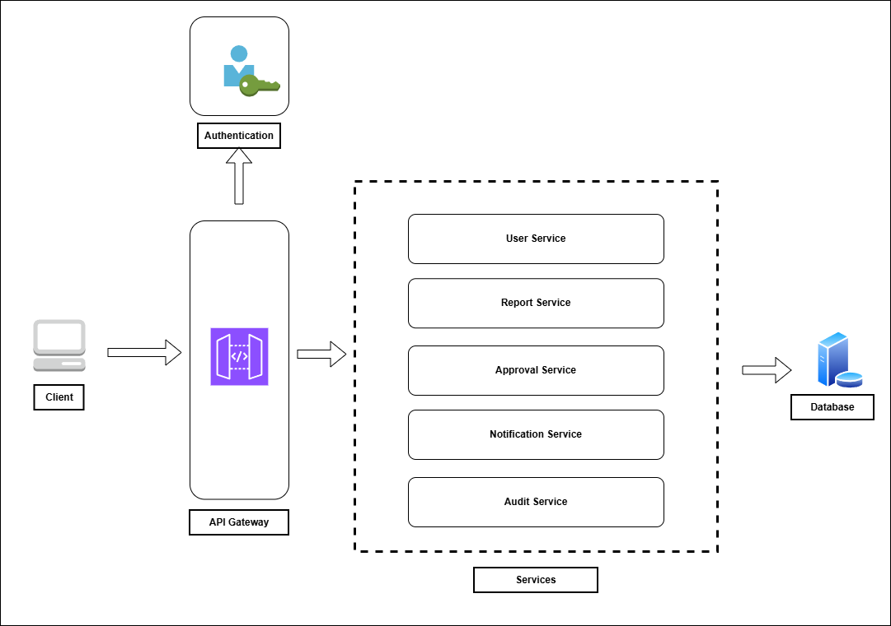
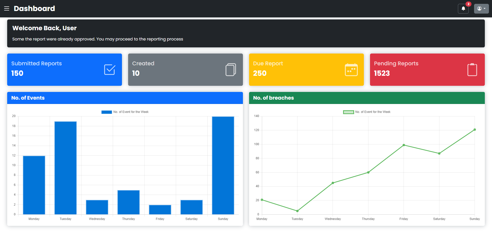

# Report Management Service (RMS)

## Purpose

Build a full‑stack web application to automate regulatory reporting for an Energy Trader. The application will manage creation, submission, approval, and audit of reports destined for agencies: Company, ERC (Energy Regulatory Commission), and DOE (Department of Energy). It will also provide user management and authentication, an API layer, and a React front‑end. The system will demonstrate API development, Event‑Driven Architecture (EDA), and microservices.

## Description

- Create a full stack wep application for Reporting Management Service. 
- Handles creation of reports to be submitted to the agencies namely Company, ERC and DOE
- The purpose of the web application is automate the reporting of the Energy Trader.
- Handles new users and authentication
- API Services to handle the request of the client
- React Application for the front-end and have interaction on the application
- Learning the to apply concepts of API development, EDA (Event Driven Arch), Microservice, React App development

## Audience

- Energy Traders (primary users) — create and submit reports
- Compliance Officers / Managers — review and approve reports
- Regulatory Agencies (Company, ERC, DOE) — receive reports (external recipients)
- Administrators — user and system management
- DevOps / Engineers — deploy and maintain the system

## Goals

- Automate report generation and submission to regulatory agencies
- Enforce approval workflows and role‑based access
- Provide auditable trails for all report actions
- Be modular: microservices + event‑driven communication
- Provide a responsive web UI in React for users

## Technology

- Python - FastAPI (Create, Update, Delete), QL (Read or Retreive Data)
- Javascript - React
- PostgreSQL

## Architecture

### Front End 
- insert flow here

### API Architecture

## Flow charts
- insert flow chart
1. User Interacts with the Application, create login page
2. User sees the dashboard of outstanding report.
3. User can create, update or delete reports
4. User can see the Analytics tabs for seeing the KPI of the power plant
5. User can sent approval of the newly created report to their supervisor
6. User can sent the report to the agencies, when the reports was already approved
7. User can review the report for changes, when the reports was rejected
8. User seeing the email of the report to the agency
9. User tracks the reports

## Data Sources
- PostGreSQL

## Tables
- Users - employee details, if manager or an employee
- Events - shows all interaction of the user to the application
- Facility - facility details
- Audit Log - sees all logs if there is an error in the application
- Reports - reports generated in the system
- ReportTypes - dimension for ERC, DOE or Internal Reports
- Performance - show the status of the powerplant, show the performance whether its frequent outages
- Units - dimension for the generators units
- EventType - dimension if reports are deration, synchronization, planned outage or force outage
- Messaging - table for messages text to the users or subscribers [Optional] - like adding a messaging service once report is generated.

## Services
| Service                  | Responsibility                             |
| ------------------------ | ------------------------------------------ |
| **Gateway Service**      | Entry point, routes requests, handles auth |
| **User Service**         | Auth, role management (Employee, Manager)  |
| **Report Service**       | Create, store, update, approve reports     |
| **Approval Service**     | Handles approval workflow & permissions    |
| **Notification Service** | Sends alerts (email, message)              |
| **Audit Service**        | Tracks all report and approval actions     |
| **Event Bus**            | Handles async event communication          |

## Inspiration

- This project was inspired by one of my old projects with the same name, but this time I’m taking it to the next level understanding how to build a system where machines communicate with each other to handle tasks.
- The idea of automation started when I realized there are repetitive tasks that can be automated to save time and effort.
- It all began with an Excel file, where I tried to automate our reporting since there were multiple reports to manage using VBA.
- Saka malas eh laging tripped yung unit namin pag ako duty. hehe
- Hope you find something useful here! Good luck out there!